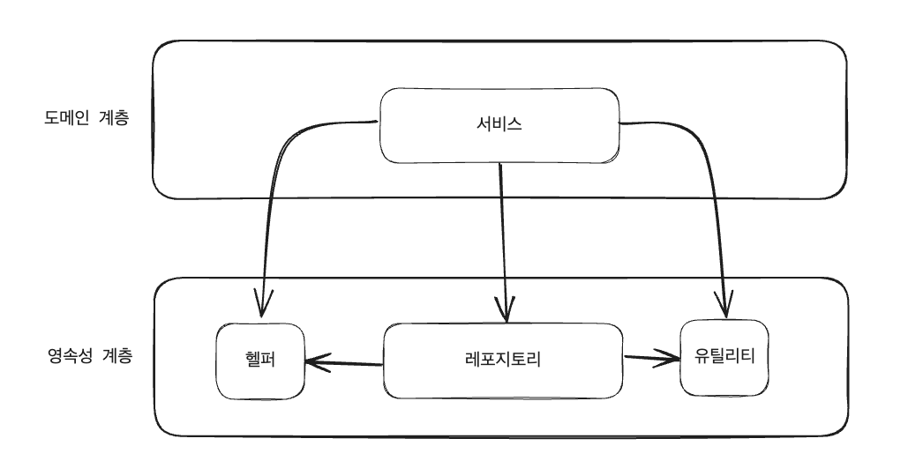

# 01. 일반적인 계층형 아키텍처의 문제점

## 데이터베이스 주도 설계를 유도한다.
- 우리(개발자)가 만드는 애플리케이션의 목적은 비즈니스를 관장하는 규칙이나 정책을 만들어 사용자가 편리하게 만들기 위함이다.
- 이때 우리는 `상태(state)` 가 아닌 `행동(behavior)`을 중심으로 모델링한다. 객체로 치면 `필드 중심` 개발이 아닌 `메서드 중심`의 개발인 셈이다.
- 애플리케이션에서 상태는 물론 중요한 요소지만 `행동이 상태를 바꾸는 주체`이기 때문에 행동이 비즈니스를 이끈다.
- 그렇기 때문에 (행동을 정의하는) 도메인을 중심으로 아키텍처를 설계해야 하지만, 대부분의 유스케이스에서 데이터베이스 중심의 영속성 계층을 우선시 하여 아키텍처를 설계한다.
  - 이는 ORM 프레임워크를 사용하는 것과 연관이 있다.

- Q. 왜 헬퍼 / 유틸리티 Components 를 도메인 계층에 두고 접근하면 안되는가?
  - A. 계층형 아키텍처에서 적용되는 유일한 규칙은, 특정 계층에서는 동일 계층이나 아래에 있는 계층에만 접근이 가능하다는 것. 영속성 계층의 레포지토리가 `헬퍼/유틸리티`에 접근하기 위해서는 상위 계층이 아닌 동일 계층에 `헬퍼/유틸리티` 컴포넌트가 존재해야 한다.
  - 문제는 어떤 계층에도 속하지 않는 것처럼 보이는 헬퍼/유틸리티 컴포넌트가 영속성 계층에 존재하게 된다.

## 유스케이스를 숨긴다.
- 비즈니스가 커질수록 기능을 추가하거나 변경할 일이 잦아지기 때문에 아키텍처는 코드를 빠르게 탐색하는데 도움이 돼야 한다.
- 이런 관점에서 계층형 아키텍처는 어떻게 우리의 발목을 잡을까?
- 계층형 아키텍처에서는 도메인 서비스의 너비에 관한 규칙을 강제하지 않는다. 시간이 지나면 하나의 서비스에서 여러개의 유스케이스를 담당하는 아주 넓은 서비스가 만들어지기도 한다.
- 넓은 서비스는 영속성 계층에 많은 의존성을 갖는다. (여러 개의 레포지토리를 의존하는 등)
- 이는 곧 웹 레이어의 많은 컴포넌트가 해당 서비스에 의존하게 되어, 서비스를 테스트 하는 것 뿐만 아니라 작업할 유스케이스를 책임지는 서비스를 찾기도 어려워진다.
- 고도로 특화된 좁은 도메인 서비스가 유스케이스 하나씩만 담당하면 위의 문제를 해결할 수 있다. 
  - ex) `UserService` 에서 사용자 등록 유스케이스를 찾는 대신 `RegisterUserService` 를 바로 열어서 작업을 시작
  - UserService : 범용적 -> 넓은 범위
  - RegisterUserService : 특화/세분화 -> 좁은 범위
  - ex) SNS 의 FeedService 에서 UserRepository(유저) 와 ProductRepository(상품) 를 의존하는 것 처럼, 서비스의 `너비`가 점점 넓어질 수 있다.

